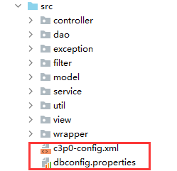
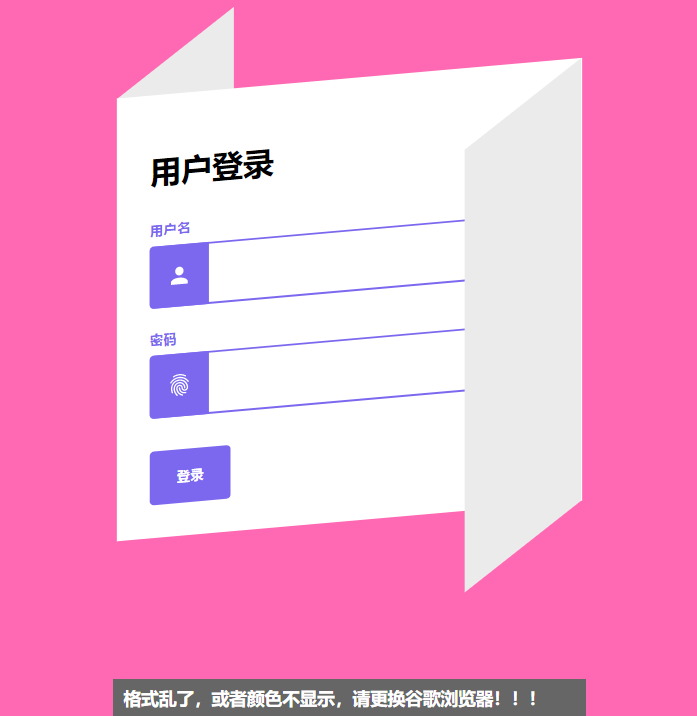
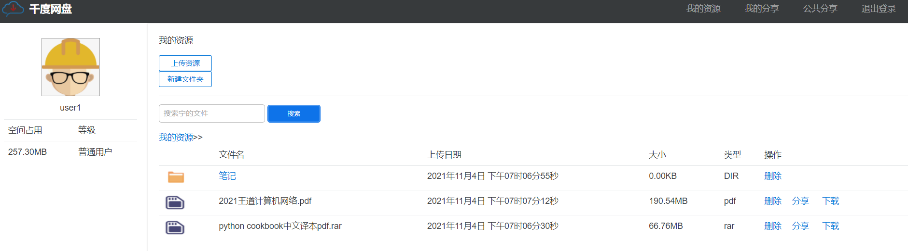
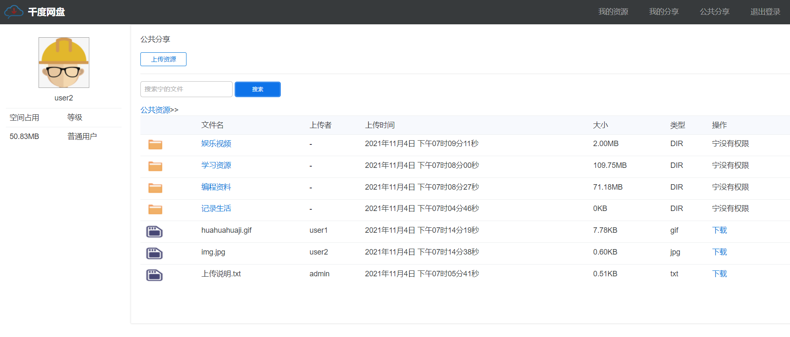
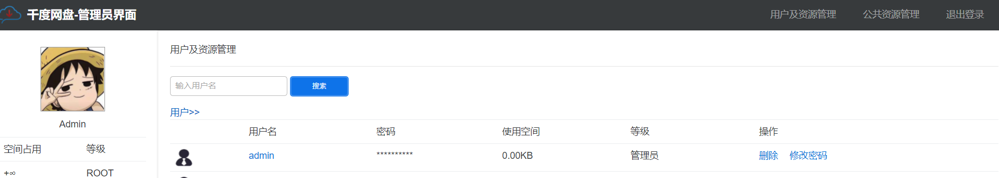

# 基本介绍

java结课设计，一款完全基于servlet的网盘系统，无后端框架、无jsp。

提供一个存储自己资源、分享自己资源、享受他人资源的文件共享平台。

# 快速搭建

```bash
git clone
cd ./pan 
```

使用项目里的.sql文件创建好项目所需的数据库



修改项目里两个的数据库配置文件为自己可用的数据库

编译成war包部署/直接将Webcontent部署到tomcat的webapp目录

Tips：第一次启动需要注册一个用户名为admin的账号，默认为管理员权限

# 项目展示








